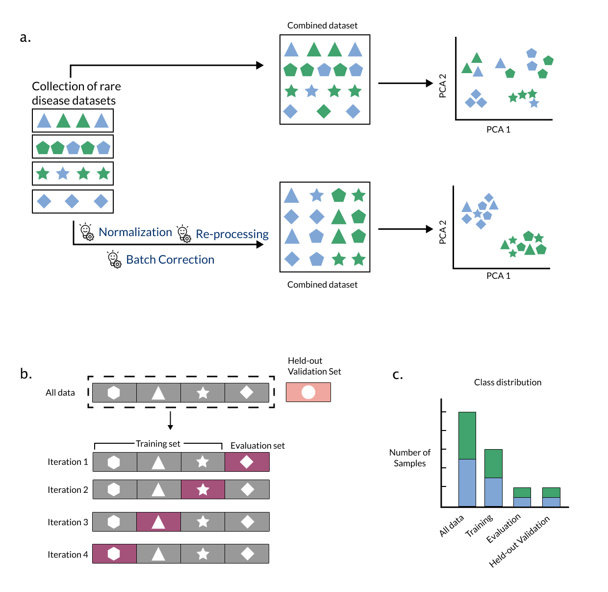

---
author-meta:
- Jineta Banerjee
- Jaclyn N Taroni
- Robert J Allaway
- Deepashree Venkatesh Prasad
- Justin Guinney
- Casey Greene
bibliography:
- content/manual-references.json
date-meta: '2022-05-22'
header-includes: "<!--\nManubot generated metadata rendered from header-includes-template.html.\nSuggest improvements at https://github.com/manubot/manubot/blob/master/manubot/process/header-includes-template.html\n-->\n<meta name=\"dc.format\" content=\"text/html\" />\n<meta name=\"dc.title\" content=\"Machine learning in rare disease\" />\n<meta name=\"citation_title\" content=\"Machine learning in rare disease\" />\n<meta property=\"og:title\" content=\"Machine learning in rare disease\" />\n<meta property=\"twitter:title\" content=\"Machine learning in rare disease\" />\n<meta name=\"dc.date\" content=\"2022-05-22\" />\n<meta name=\"citation_publication_date\" content=\"2022-05-22\" />\n<meta name=\"dc.language\" content=\"en-US\" />\n<meta name=\"citation_language\" content=\"en-US\" />\n<meta name=\"dc.relation.ispartof\" content=\"Manubot\" />\n<meta name=\"dc.publisher\" content=\"Manubot\" />\n<meta name=\"citation_journal_title\" content=\"Manubot\" />\n<meta name=\"citation_technical_report_institution\" content=\"Manubot\" />\n<meta name=\"citation_author\" content=\"Jineta Banerjee\" />\n<meta name=\"citation_author_institution\" content=\"Sage Bionetworks\" />\n<meta name=\"citation_author_orcid\" content=\"0000-0002-1775-3645\" />\n<meta name=\"citation_author\" content=\"Jaclyn N Taroni\" />\n<meta name=\"citation_author_institution\" content=\"Childhood Cancer Data Lab, Alex\u2019s Lemonade Stand Foundation\" />\n<meta name=\"citation_author_orcid\" content=\"0000-0003-4734-4508\" />\n<meta name=\"citation_author\" content=\"Robert J Allaway\" />\n<meta name=\"citation_author_institution\" content=\"Sage Bionetworks\" />\n<meta name=\"citation_author_orcid\" content=\"0000-0003-3573-3565\" />\n<meta name=\"twitter:creator\" content=\"@allawayr\" />\n<meta name=\"citation_author\" content=\"Deepashree Venkatesh Prasad\" />\n<meta name=\"citation_author_institution\" content=\"Childhood Cancer Data Lab, Alex\u2019s Lemonade Stand Foundation\" />\n<meta name=\"citation_author_orcid\" content=\"0000-0001-5756-4083\" />\n<meta name=\"citation_author\" content=\"Justin Guinney\" />\n<meta name=\"citation_author_institution\" content=\"Sage Bionetworks\" />\n<meta name=\"citation_author_orcid\" content=\"0000-0003-1477-1888\" />\n<meta name=\"citation_author\" content=\"Casey Greene\" />\n<meta name=\"citation_author_institution\" content=\"Department of Systems Pharmacology and Translational Therapeutics, Perelman School of Medicine, University of Pennsylvania\" />\n<meta name=\"citation_author_institution\" content=\"Childhood Cancer Data Lab, Alex\u2019s Lemonade Stand Foundation\" />\n<meta name=\"citation_author_orcid\" content=\"0000-0001-8713-9213\" />\n<link rel=\"canonical\" href=\"https://jaybee84.github.io/ml-in-rd/\" />\n<meta property=\"og:url\" content=\"https://jaybee84.github.io/ml-in-rd/\" />\n<meta property=\"twitter:url\" content=\"https://jaybee84.github.io/ml-in-rd/\" />\n<meta name=\"citation_fulltext_html_url\" content=\"https://jaybee84.github.io/ml-in-rd/\" />\n<meta name=\"citation_pdf_url\" content=\"https://jaybee84.github.io/ml-in-rd/manuscript.pdf\" />\n<link rel=\"alternate\" type=\"application/pdf\" href=\"https://jaybee84.github.io/ml-in-rd/manuscript.pdf\" />\n<link rel=\"alternate\" type=\"text/html\" href=\"https://jaybee84.github.io/ml-in-rd/v/fe256affe23522a852223ce146ef57c013d136b0/\" />\n<meta name=\"manubot_html_url_versioned\" content=\"https://jaybee84.github.io/ml-in-rd/v/fe256affe23522a852223ce146ef57c013d136b0/\" />\n<meta name=\"manubot_pdf_url_versioned\" content=\"https://jaybee84.github.io/ml-in-rd/v/fe256affe23522a852223ce146ef57c013d136b0/manuscript.pdf\" />\n<meta property=\"og:type\" content=\"article\" />\n<meta property=\"twitter:card\" content=\"summary_large_image\" />\n<link rel=\"icon\" type=\"image/png\" sizes=\"192x192\" href=\"https://manubot.org/favicon-192x192.png\" />\n<link rel=\"mask-icon\" href=\"https://manubot.org/safari-pinned-tab.svg\" color=\"#ad1457\" />\n<meta name=\"theme-color\" content=\"#ad1457\" />\n<!-- end Manubot generated metadata -->"
keywords:
- rare disease
- machine learning
- transfer learning
lang: en-US
manubot-clear-requests-cache: false
manubot-output-bibliography: output/references.json
manubot-output-citekeys: output/citations.tsv
manubot-requests-cache-path: ci/cache/requests-cache
title: Machine learning in rare disease
...

<small><em>
This manuscript
([permalink](https://jaybee84.github.io/ml-in-rd/v/fe256affe23522a852223ce146ef57c013d136b0/))
was automatically generated
from [jaybee84/ml-in-rd@fe256af](https://github.com/jaybee84/ml-in-rd/tree/fe256affe23522a852223ce146ef57c013d136b0)
on May 22, 2022.
</em></small>

## Authors

+ **Jineta Banerjee**
  ☯ 
    {.inline_icon}
    [0000-0002-1775-3645](https://orcid.org/0000-0002-1775-3645)
    · {.inline_icon}
    [jaybee84](https://github.com/jaybee84) 
  <small>
     Sage Bionetworks
     · Funded by Neurofibromatosis Therapeutic Acceleration Program; Children's Tumor Foundation
  </small>

+ **Jaclyn N Taroni**
  ☯ 
    {.inline_icon}
    [0000-0003-4734-4508](https://orcid.org/0000-0003-4734-4508)
    · {.inline_icon}
    [jaclyn-taroni](https://github.com/jaclyn-taroni) 
  <small>
     Childhood Cancer Data Lab, Alex’s Lemonade Stand Foundation
  </small>

+ **Robert J Allaway**
   
    {.inline_icon}
    [0000-0003-3573-3565](https://orcid.org/0000-0003-3573-3565)
    · {.inline_icon}
    [allaway](https://github.com/allaway)
    · {.inline_icon}
    [allawayr](https://twitter.com/allawayr) 
  <small>
     Sage Bionetworks
     · Funded by Neurofibromatosis Therapeutic Acceleration Program; Children's Tumor Foundation
  </small>

+ **Deepashree Venkatesh Prasad**
   
    {.inline_icon}
    [0000-0001-5756-4083](https://orcid.org/0000-0001-5756-4083)
    · {.inline_icon}
    [dvenprasad](https://github.com/dvenprasad) 
  <small>
     Childhood Cancer Data Lab, Alex’s Lemonade Stand Foundation
  </small>

+ **Justin Guinney**
   
    {.inline_icon}
    [0000-0003-1477-1888](https://orcid.org/0000-0003-1477-1888)
    · {.inline_icon}
    [jguinney](https://github.com/jguinney) 
  <small>
     Sage Bionetworks
     · Funded by Neurofibromatosis Therapeutic Acceleration Program; Children's Tumor Foundation
  </small>

+ **Casey Greene**
  ✉ 
    {.inline_icon}
    [0000-0001-8713-9213](https://orcid.org/0000-0001-8713-9213)
    · {.inline_icon}
    [cgreene](https://github.com/cgreene) 
  <small>
     Department of Systems Pharmacology and Translational Therapeutics, Perelman School of Medicine, University of Pennsylvania; Childhood Cancer Data Lab, Alex’s Lemonade Stand Foundation
  </small>

☯: These authors contributed equally to this work.

✉: Corresponding author; Please address your emails to <casey.s.greene@cuanschutz.edu>.

## Synopsis {.page_break_before}

(Instructions: Describe the background, basic structure of the article, list material to be covered indicating depth of coverage, how they are logically arranged, include recent pubs in the area, 300-500 words)

The advent of high-throughput profiling methods such as genomics, transcriptomics, and other technologies has accelerated basic research and made deep characterization of patient samples routine.
These approaches provide a rich portrait of genes, cellular pathways, and cell types involved in complex phenotypes.
Machine learning is often a remarkable fit for extracting disease-relevant patterns from these high dimensional datasets.
However, machine learning methods require a large number of samples to identify recurrent and biologically meaningful patterns.
With rare diseases, biological specimens or clinical cases, and consequently data, are inherently limited due to the rarity of the condition.
Precision medicine also presents a similar challenge, where a common disease is partitioned into small subsets of patients with limited amount of data in each subset. 
In this perspective, we outline the challenges and emerging solutions for using machine learning in the context of small sample sets, specifically that of rare diseases.
Advances from research of machine learning methods for rare disease are likely to be highly informative for applications well beyond rare diseases. 
We propose that the methods community prioritize development of machine learning techniques for rare disease research.

## Introduction {.page_break_before}

Rare disease researchers increasingly depend on machine learning to analyze complex datasets.
A systematic review of the application of ML in rare diseases uncovered 211 human data studies that used ML to study 74 different rare diseases over the last 10 years.[@doi:10.1186/s13023-020-01424-6] 
Indeed, ML can be a powerful tool in biomedical research but it does not come without pitfalls, some of which are magnified in a rare disease context.[@doi:10.3389/fmed.2021.747612]
In this perspective, we will discuss considerations for using two types of ML (supervised and unsupervised learning) in the context of the study of rare diseases.

ML algorithms are computational methods that can identify patterns in data, and can use information about these patterns to perform tasks (e.g., pick out important data points or predict outcomes when they are not yet known). 
_Supervised learning_ algorithms must be trained with data that has specific phenotype or outcome labels (e.g., in a clinical study: complete response, partial response, or progressive disease). 
Supervised methods can learn correlations of features with the outcome labels to predict the outcome in unseen or new test data (e.g., predicting which patients would or would not respond to treatment).
Therefore, if the goal of a study is to classify patients with a rare disease into well-known molecular subtypes based on high-throughput profiling, a supervised ML algorithm would be appropriate to carry out this task. 
Conversely, _unsupervised learning_ algorithms can learn patterns or features from _unlabeled_ training data.
In the absence of known molecular subtypes, unsupervised ML approaches can be applied to identify groups of samples that are similar and may have distinct patterns of pathway activation [@doi:10.1158/0008-5472.CAN-08-2100].
Unsupervised approaches can also extract combinations of features (e.g., genes) that are indicative of a certain cell type or pathway.

While ML can be a useful tool, there are challenges in applying ML to rare disease datasets. 
ML methods are generally most effective when using large datasets; analyzing high dimensional data from rare diseases datasets that typically contain 20 to 99 samples is challenging [@https://www.fda.gov/media/99546/download; @doi:10.1186/s13023-020-01424-6].
Small datasets lead to a lack of statistical power and magnify the susceptibility of ML methods to misinterpretation and unstable performance.
For example, with insufficient data, an unsupervised model will fail to identify patterns that are useful for biological discovery.
Similarly, supervised models require datasets where the phenotype labels have very little uncertainty (or “label-noise”) [@doi:10.1093/jamia/ocw028] – termed "gold standard" datasets. 
Datasets with high label-noise decrease prediction accuracy and necessitate larger sample sizes during training [@doi:10.1109/tnnls.2013.2292894], and rare disease datasets often come with significant label-noise (e.g., _silver standard_ datasets) due to limited understanding of the underlying biology or evolving clinical classifications.
Additionally, a supervised ML model is of limited utility if it can only accurately predict phenotype labels in the data it was trained on (also known as _overfitting_); instead, most researchers aspire to develop models that _generalize_ or maintain performance when applied to new data that has not yet been "seen" by the model.

While we expect ML in rare disease research to continue to increase in popularity, specialized computational methods that can learn patterns from small datasets and can generalize to newly acquired data are required for rare disease applications [@doi:10.1016/j.ebiom.2019.08.027]. 
In this perspective, we first highlight approaches that address or better tolerate the limitations of rare disease data, and then discuss the future of ML applications in rare disease.

## Constructing machine learning-ready rare disease datasets

High-throughput 'omic' data methods generate high-dimensional data (or data containing many features), regardless of the underlying disease or condition being assayed.
A typical rare disease dataset is comprised of a small number of samples [@doi:10.1186/s13023-020-01424-6].
A lack of samples gives rise to the “curse of dimensionality” (i.e., few samples but many features), which can contribute to the poor performance of models [@doi:10.1038/nrc2294].
More features often means increased missing observations (_sparsity_), more dissimilarity between samples (_variance_), and increased redundancy between individual features or combinations of features (_multicollinearity_) [@doi:10.1038/s41592-018-0019-x], all of which contribute to a challenges in ML implementation.

When small sample sizes compromise an ML model's performance, then two approaches can be taken to manage sparsity, variance, and multicollinearity: 1) increase the number of samples, 2) improve the quality of samples.
In the first approach, appropriate training, evaluation, and held-out validation sets could be constructed by combining multiple rare disease cohorts (Figure {@fig:1}a, Box 1).
When combining datasets, special attention should be directed towards _data harmonization_ since data collection methods can differ from cohort to cohort.
Without careful selection of aggregation methods, one may introduce variability into the combined dataset that can negatively impact the ML model's ability to learn or detect meaningful signal.
Steps such as reprocessing the data using a single pipeline, using batch correction methods [@doi:10.1093/biostatistics/kxj037; @doi:10.1093/nar/gku864], and normalizing raw values [@doi:10.1186/gb-2010-11-3-r25] may be necessary to mitigate unwanted variability. (Figure {@fig:1}a)

In the second approach, small but thoughtfully generated datasets can enhance the performance of ML models.
One way to improve the quality of a dataset is to improve the accuracy of clinical annotations or phenotypes for each sample in the dataset, which may increase the effectiveness of ML models in extracting biologically relevant patterns. 
The recognized need for improved labeling of, for instance, genomic data is highlighted by the recent introduction of the Phenopackets standard for sharing clinical phenotype data [@url:https://www.ga4gh.org/news/phenopackets-standardizing-and-exchanging-patient-phenotypic-data/; @url:https://phenopacket-schema.readthedocs.io/en/2.0.0/basics.html].
Collaboration with domain experts to boost the value of research datasets through careful annotation, and subsequent sharing of well-annotated datasets, is required to foster effective use of datasets in the future.

How does one know if a composite dataset has undergone proper harmonization and annotation?
Ideally, the structure of the composite dataset is reflects differences in variables of interest, such as phenotype labels.
If the samples from the same cohort tend to group together regardless of phenotype, this suggests that the datasets used to generate the composite dataset need to be corrected to overcome differences in how the data were generated or collected.
In the next section, we will discuss approaches that can aid in identifying and visualizing structure in datasets to determine whether composite rare disease datasets are appropriate for use in ML.

{#fig:1}

## Box 1: Understanding experimental design of ML to inform requirements for data

### Components of ML experiments

Machine learning (ML) algorithms identify patterns that explain or fit a given dataset.
Every ML algorithm goes through _training_, where it identifies underlying patterns in a given dataset to create a "trained" algorithm (a _model_), and _testing_, where the model applies the identified patterns to unseen data points.
Typically, a ML algorithm is provided with: 1. a _training dataset_ , 2. an _evaluation dataset_ , 3. a _held-out validation dataset_.
These input data can be images, text, numbers, or other types of data which are typically encoded as a numerical representation of the input data. 
A _training dataset_ is used by the model to learn underlying patterns from the features present in the data of interest.
An _evaluation dataset_ is a small and previously unused dataset which is used during the training phase to help the model iteratively update its parameters (i.e., _hyperparameter tuning_ or _model tuning_).
In many cases, a large training set may be subdivided to form a smaller training dataset and the evaluation dataset, both of which are used to train the model.
In the testing phase, a completely new or unseen test dataset or _held-out validation set_ is used to test whether the patterns learned by the model hold true in new data (i.e., they are _generalizable_).
While the evaluation dataset helps us refine a model's "knowledge" of patterns in the training data, the held-out validation set helps us test the generalizability of the model.

If a model is generalizable, it is able to make accurate predictions on new data.
High generalizability of a model on previously unseen data suggests that the model has identified important patterns in the data that are not unique to the data used for training and tuning.
Generalizability can be affected if _data leakage_ occurs during training of the model, i.e., if a model is exposed to the same or related data points in both the training set and the held-out test set.
Ensuring absence of any overlap or relatedness among data points or samples used in the training set and evaluation set is important to avoid data leakage during model training.
Specifically, in cases of rare genetic diseases where, for example, many samples can contain familial relationships or data from the same patient could be collected by multiple specialists at different clinical facilities, special care should be taken while crafting the training and testing sets to ensure that no data leakage occurs and the trained model has high generalizability.

### Training and testing

The implementation of a ML experiment begins with splitting a single dataset of interest such that a large proportion of the of the data (e.g., 70-90%) is used for training (generally subdivided into the _training dataset_ and the _evaluation dataset_), and the remaining data is used for testing or validation (as the _held-out validation dataset_).
This ensures that all of the datasets involved in training and testing a model have uniform features.
In rare diseases where multiple datasets may be combined to make a large enough training dataset, special care should be taken to standardize the features and the patterns therein.
The iterative training phase helps the model learn important patterns in the training dataset and then use the evaluation dataset to test for errors in prediction and update its learning parameters (_hyperparameter tuning_).
The method by which the evaluation dataset tests the performance of the trained model and helps update the hyperparameters is called _cross-validation_.
There are multiple approaches that can be deployed to maximally utilize the available data when generating training and evaluation datasets e.g., leave-p-out cross-validation, leave-one-out cross-validation, k-fold cross-validation, Monte-Carlo random subsampling cross-validation [@doi:10.1007/978-1-4614-6849-3].
In the case of k-fold cross-validation, a given dataset is shuffled randomly and split into _k_ parts.
One of the _k_ parts is reserved as the _evaluation dataset_ and the rest are cumulatively used as the _training dataset_.
In the next iteration, a different part is used as the _evaluation dataset_, while the rest are used for training.
Once the model has iterated through all _k_ parts of the training and evaluation datasets, it is ready to be tested on the _held-out validation_ dataset. (Figure {@fig:1}b)

The held-out validation dataset is exposed to the model only once to estimate the accuracy of the model.
High accuracy of a model during cross-validation but low accuracy on the held-out dataset is a sign that the model has become overfit to the training set and has low generalizability.
If this is encountered, the modeller should revisit the construction of the dataset to make sure they meet the best practices outlined above.

## Learning representations from rare disease data

Dimensionality reduction methods can help explore and visualize underlying structure in the dataset (e.g., [@doi:10.1038/s41467-019-13056-x]), to define sample subgroups (e.g., [@doi:10.1038/s41467-020-15351-4], or for feature selection and extraction during application of specific machine learning models [@doi:10.1007/978-3-030-03243-2_299-1] (Figure [@fig:2]c).
These methods ‘compress’ information from a large number of features into a smaller number of features in an unsupervised manner [@doi:10.1007/978-3-540-33037-0; @doi:10.1098/rsta.2015.0202, @https://www.jmlr.org/papers/v9/vandermaaten08a.html; @https://arxiv.org/abs/1802.03426; @doi:10.1016/j.media.2020.101660; @doi:10.1038/ncomms14825] (Figure {@fig:2}).
An example of a method that is commonly used for dimensionality reduction is principal components analysis (PCA).
PCA identifies new features or dimensions, termed principal components (PCs), that are combinations of original features.
The PCs are calculated in a way that maximizes the amount of information (_variance_) they contain and ensures that each PC is uncorrelated with the other PCs [@doi:10.1098/rsta.2015.0202].
In practice, researchers often use the first few PCs to reduce the dimensionality without removing what may be important or informative variability in the data.
Other methods like multidimensional scaling (MDS), t-distributed stochastic neighbor embedding (t-SNE), and uniform manifold approximation and projection (UMAP) can also help identify useful patterns in the data, though t-SNE and UMAP may require adjusting the hyperparameters that may affect the output [@https://arxiv.org/abs/1802.03426; @doi:10.23915/distill.00002].
Testing multiple dimensionality reduction methods, rather than a single method, may be necessary to obtain a more comprehensive portrait of the data [@doi:10.1186/s13059-020-02021-3]. 
Nguyen and Holmes discuss additional important considerations for using dimensionality reduction methods such as selection criteria and interpretation of results [@doi:10.1371/journal.pcbi.1006907].
Beyond dimensionality reduction, other unsupervised learning approaches such as k-means clustering or hierarchical clustering have been used to characterize the structure present in genomic or imaging data [@doi:10.1186/1471-2105-9-497; @doi:10.1109/jbhi.2013.2276766].

Representation learning approaches (which include dimensionality reduction) learn low-dimensional representations (composite features) from the raw data.
For example, representation learning through matrix factorization method can extract features from transcriptomics datasets that are made of combinations of gene expression values [@doi:10.1038/s41467-020-14666-6; @doi:10.1093/bioinformatics/btq503; @doi:10.1186/s13059-020-02021-3].
Representation learning generally requires many samples when applied to complex biological systems and therefore may appear to aggravate the curse of dimensionality. 
However, it can be a powerful tool to learn low-dimensional patterns from large datasets and then find those patterns in smaller, related datasets. 
In later sections, we will discuss this method of leveraging large datasets to reduce dimensionality in smaller datasets, also known as feature-representation-transfer learning. 
Once the dimensions of the training dataset have been reduced, model training can proceed using the experimental design as outlined in Box 1.

![Representation learning can extract useful features from high dimensional data. A) The data (e.g., transcriptomic data) are highly dimensional, having thousands of features (displayed as Fa-Fz). Samples come from two separate classes (purple and green row annotation).  B) In the original feature space, Fa and Fb do not separate the two classes (purple and green) well. C) A representation learning approach learns new features (e.g., New Feature 1, a combination of Fa, Fb .... Fz, and New Feature 2, a different combination of Fa, Fb .... Fz). New Feature 2 distinguishes class, whereas New Feature 1 may capture some other variable such as batch (not represented). New features from the model can be used to interrogate the biology of the input samples, develop classification models, or use other analytical techniques that would have been more difficult with the original dataset dimensions.](content/images/figures/pdfs/figure2-representation-learning.png){#fig:2}

## Reducing misinterpretation of model output with statistical techniques 

Machine learning methods generally work well on data that meet a few critical assumptions. 
First, the dataset contains equal number of samples for all categories (no "class imbalance").
Second, the dataset is complete; all samples have measurements for all variables in the dataset (i.e., the dataset is not "sparse", meaning that it is not missing data for some of the samples).
Third, there is no ambiguity about the labels for the samples in the dataset (i.e., no "label-noise"). 

Rare disease datasets, however, violate many of these assumptions.
There is generally a high _class imbalance_ due to small number of samples for specific classes (e.g., only a few patients with a particular rare disease in a health records dataset), the data are often _sparse_, and there may be abundant _label-noise_ due to incomplete understanding of the disease.
All of these contribute to low signal to noise ratio in rare disease datasets.
Thus, applying ML to rare disease data without addressing the aforementioned shortcomings may lead to models that have low reproducibility or are hard to interpret.

Class imbalance in datasets can be addressed using decision tree-based ensemble learning methods (e.g., random forests)[@doi:10.1007/s11634-019-00354-x] (Figure[@fig:3]a).
Random forests use resampling (with replacement) based techniques to form a consensus about the important predictive features identified by the decision trees [@https://doi.org/10.1023/A:1010933404324; @doi:10.1186/1472-6947-13-134].
Additional approaches like combining random forests with resampling without replacement can generate confidence intervals for the model predictions by iteratively exposing the models to incomplete datasets, mimicking real world cases where most rare disease datasets are incomplete [@doi:10.3390/genes11020226].
Resampling approaches are most helpful in constructing confidence intervals for algorithms that generate the same outcome every time they are run (i.e., deterministic models).
For decision trees that choose features at random for selecting a path to the outcome (i.e., are non-deterministic), resampling approaches can be helpful in estimating the reproducibility of the model. 

In situations where decision tree-based ensemble methods fail when they are applied to rare disease datasets, cascade learning has been a viable alternative [@pmid:30815073].
In cascade learning, multiple methods leveraging distinct underlying assumptions are used in tandem to capture stable patterns existing in the dataset [@doi:10.1109/cvpr.2001.990537; @doi:10.1007/978-3-540-75175-5_16; @doi:10.1109/icpr.2004.1334680]. 
For example, a cascade learning approach for identifying rare disease patients from electronic health record data incorporated independent steps for feature extraction (word2vec [@arxiv:1301.3781]), preliminary prediction with ensembled decision trees, and then prediction refinement using data similarity metrics [@pmid:30815073]. 
Combining these three methods resulted in better overall prediction when implemented on a silver standard dataset, as compared to a model that used ensemble-based prediction alone.
In addition to cascade learning, other approaches that can better represent rare classes using class re-balancing techniques like inverse sampling probability weighting [@doi:10.1186/s12911-021-01688-3], inverse class frequency weighting [@doi:10.1197/jamia.M3095], oversampling of rare classes [doi:10.1613/jair.953], or undersampling of majority class [@doi:10.48550/arXiv.1608.06048] may also help mitigate limitations due to class imbalance. 

The presence of label-noise and sparsity in the data can lead to overfitting of models to the training data, meaning that the models show high prediction accuracy on the training data but low prediction accuracy (and large prediction errors) on new evaluation data. 
Overfit models tend to rely on patterns that are unique to the training data (for example, the clinical vocabulary or clinical coding practices at a specific hospital), and not generalizable to new data (e.g., data collected at different hospitals). [@isbn:0262035618; @pmc:PMC8238368]
Regularization can help in these scenarios.
Regularization is an approach by which a penalty or constraint is added to a model to avoid making large prediction errors.
These procedures can not only protect ML models as well as learned representations from poor generalizability caused by overfitting, but also reduce model complexity by reducing the feature space available for training [@doi:10.1371/journal.pgen.1004754, @doi:10.1002/sim.6782]. (Figure[@fig:3]a)
Some examples of ML methods with regularization include ridge regression, LASSO regression, and elastic net regression [@doi:10.1111/j.1467-9868.2005.00503.x], among others.
Regularization is often used in rare variant discovery and immune cell signature discovery studies; much like rare disease, these examples need to accommodate sparsity in data.
For example, LASSO has been used to capturing combinations of rare and common variants associated with specific traits have proven beneficial [@doi:10.1186/1753-6561-5-s9-s113].
In this example, applying LASSO regularization reduced the number of common variants included as features in the final analysis generating a simpler model while reducing error in the association of common and rare variants with a specific trait. 
In the context of rare immune cell signature discovery, variations of elastic-net regression were found to outperform other regression approaches [@doi:10.1016/j.compbiomed.2015.10.008; @doi:10.1186/s12859-019-2994-z]. 
Thus, regularization methods like LASSO or elastic-net are beneficial in ML with rare observations, and are worth exploring in the context of rare diseases.[@doi:10.1371/journal.pgen.1004754] 
Other examples of regularization that have been successfully applied to rare disease ML include using Kullback–Leibler (KL) divergence loss or dropout during neural network training.
In a study using a variational autoencoder (VAE) (see Box 2: Definitions) for dimensionality reduction in gene expression data from acute myeloid leukemia (AML) samples, the KL loss between the input data and its low dimensional representation provided the regularizing penalty for the model. [@doi:10.1101/278739; @doi:10.48550/arXiv.1312.6114]
In a study using a convolutional neural network (CNN) to identify tubers in MRI images from tuberous sclerosis patients, overfitting was minimized using the dropout regularization method which removed randomly chosen network nodes in each iteration of the CNN model generating simpler models in each iteration.[@doi:10.1371/journal.pone.0232376]
Thus, depending on the learning method that is used, regularization approaches should be incorporated into data analysis when working with rare disease datasets. 

![TODO: OLD FIGURE (new figure still WIP) Strategies to simplify models and stabilize predictions preserve the value of machine learning in rare disease. A-B) Strategies to build confidence in model predictions; A) A schematic showing the concept of bootstrap, B) A schematic showing the concept of ensemble learning to converge on reliable models; C-D) Strategies to simplify models by penalizing complexity in ML models; C) A schematic showing the concept of regularization to selectively learn relevant features, D) A schematic showing the concept of one-class-at-a-time learning to select few features at a time. Horizontal bars represent health of a model, models are represented as a network of nodes (features) and edges (relationships), nodes with solid edges represent real patterns, nodes with broken edges represent spurious patterns](images/figures/pdfs/statistical-techniques.png){#fig:3}

### Build upon prior knowledge and indirectly related data {.page_break_before}

Rare diseases often lack large, normalized datasets, limiting our ability to study key attributes of these diseases. 
One strategy to overcome this is to integrate and explore rare disease information alongside other knowledge by combining a variety of different data types. 
By using several data modalities (such as curated pathways, genetic data, or other data types), it may be possible to gain a better understanding of rare diseases (e.g., identifying novel genotype-phenotype relationships or opportunities for drug repurposing).
Knowledge graphs (KGs) which integrate related-but-different data types, provide a rich multimodal data source (e.g., Monarch Graph Database [@doi:10.1093/nar/gkw1128], hetionet [@doi:10.7554/elife.26726], PheKnowLator [@doi:10.1101/2020.04.30.071407], and the Global Network of Biomedical Relationships [@doi:10.1093/bioinformatics/bty114], Orphanet [@http://www.orpha.net]). 
These graphs connect genetic, functional, chemical, clinical, and ontological data so that relationships of data with disease phenotypes can be explored through manual review [@doi:10.1093/database/baaa015] or computational methods [@doi:10.1016/j.jbi.2021.103838, @doi:10.1142/9789811215636_0041; @doi:10.1186/s12911-019-0938-1]. (Figure[@fig:3]a)
KGs may include links (also called edges) or nodes that are specific to the rare disease of interest (e.g., an FDA approved treatment would be a specific disease-compound edge in the KG) as well as edges that are more generalized (e.g., gene-gene interactions noted in the literature for a different disease). (Figure {@fig:4}a)

Rare disease researchers can repurpose general (i.e., not rare disease-specific) biological or chemical knowledge graphs to answer rare disease-based research questions [@doi:10.1142/9789811215636_0041]. 
There are a variety of tactics to sift through the large amounts of complex data in knowledge graphs.
One such tactic is to calculate the distances between nodes of interest (e.g., diseases and drugs to identify drugs for repurposing in rare disease [@doi:10.1142/9789811215636_0041]); this is often done by determining the "embeddings" (linear representations of the position and connections of a particular point in the graph) for nodes in the knowledge graph, and calculating the similarity between these embeddings. 
Effective methods to calculate node embeddings that can generate actionable insights for rare diseases is an active area of research [@doi:10.1142/9789811215636_0041].

Another application of KGs is to augment or refine a dataset [@doi:10.1186/s12911-019-0752-9, doi:10.1186/s12911-019-0938-1].
For example, Li et. al.[@doi:10.1186/s12911-019-0938-1] used a KG to identify linked terms in a medical corpus from a large number of patients, some with rare disease diagnoses.
They were able to augment their text dataset by identifying related terms in the clinical text to map them to the same term - e.g., mapping "cancer" and "malignancy" in different patients to the same clinical concept. 
With this augmented and improved dataset, they were able to train and test a variety of text classification algorithms to identify rare disease patients within their corpus. (Figure [@fig:4]b)

Finally, another possible tactic for rare disease researchers is to take a knowledge graph, or an integration of several knowledge graphs, and apply neural network-based algorithms optimized for graph data, such as a graph convolutional neural network.
Rao and colleagues [@doi:10.1186/s12920-018-0372-8] describe the construction of a KG using phenotype information (Human Phenotype Ontology) and rare disease information (Orphanet) and curated gene interaction/pathway data (Lit-BM-13, WikiPathways) [@doi:10.1093/nar/gkaa1043; @doi:10.1016/j.cell.2014.10.050; @doi: 10.1093/nar/gkaa1024]. 
They then trained a spectral graph convolution neural network on this KG to identify and rank potentially causal genes for the rare diseases from Orphanet, and were able to use this model to accurately predict causal genes for a ground truth dataset of rare diseases with known causal genes. 
While several groups have already published on the use of KGs to study rare diseases, we expect that the growth of multi-modal datasets and methods to analyze KGs will make them a more popular and important tool in the application of ML in rare disease. 

Another approach that builds on prior knowledge and large volumes of related data is transfer learning.
Transfer learning leverages shared features, e.g., normal developmental processes that are aberrant in disease or an imaging anomaly present in both rare and common diseases, to advance our understanding of rare diseases. 
Transfer learning, where a model trained for one task or domain (source domain) is applied to another related task or domain (target domain), can be supervised or unsupervised. 
Among various types of transfer learning, feature-representation-transfer approaches learn representations from the source domain and apply them to a target domain [@doi:10.1109/tkde.2009.191](Figure [@fig:4]c-e).
That is, representation learning, as discussed in an earlier section, does not need to be applied only to describe the dataset on which the algorithm was trained (Figure [@fig:4]c) – it can also be used to elucidate signals in sufficiently similar data (Figure [@fig:4]e) and may offer an improvement in descriptive capability over models trained on small rare disease datasets alone (Fig [@fig:4]d).
For instance, low-dimensional representations can be learned from tumor transcriptomic data and transferred to describe patterns associated with genetic alterations in cell line data [@doi:10.1186/s13059-020-02021-3](Figure [@fig:4]e).
In the next section, we will summarize specific instances of applying transfer learning, along with other techniques described herein, to the study of rare diseases.

![Strategies that build upon prior knowledge help ML models learn patterns in rare disease datasets. A) Knowledge graphs integrate different data types (e.g., genetic, functional, clinical, chemical, and ontological data) and may allow models to learn from connections that are rare disease-specific or happen in many biomedical contexts. There are a variety of possible applications of this approach, including identifying new disease-drug relationships [@doi:10.1142/9789811215636_0041], augmenting data to improve accuracy of models trained on the data [@doi:10.1186/s12911-019-0752-9, doi:10.1186/s12911-019-0938-1], or mining prior knowledge to discover important gene sets and pathways in rare diseases [@doi:10.1186/s12920-018-0372-8].  B) Knowledge graphs can also be used to augment data. Li et. al. [@doi:10.1186/s12911-019-0938-1] applied a classifier to an EHR corpus to identify rare disease patients. They trained a classifier on the EHR data alone (e.g., thrombocytopenia, anemia) and trained another classifier on data augmented with medically-related concepts from a knowledge graph (e.g., neutropenia, stroke). The classifier trained on knowledge-graph augmented data has lower error and higher accuracy.  C) A model can learn a representation from a collection of samples that do not directly assay a rare disease of interest. D) Representation learning models trained on rare disease datasets may learn representations that are less useful for descriptive analysis of those datasets due to the sample size and lack of variation. E) Learned representations from sufficiently related data (from panel C) can be transferred to rare disease dataset (from panel D) for improved descriptive analyses.](images/figures/pdfs/figure-4-KG-transfer-learning.png){#fig:4}

### Combining approaches is required for the successful application of machine learning to rare diseases

We have described multiple approaches for maximizing the success of ML applications in rare disease, but it is rarely sufficient to use any of these techniques in isolation. 
Below, we highlight two recent examples in the rare disease domain that draw on concepts of feature-representation-transfer, use of prior data, and regularization.

A large public dataset of acute myeloid leukemia (AML) patient samples with no drug response data and a small _in vitro_ experiment with drug response data form the basis of our first example [@doi:10.1038/s41467-017-02465-5].
Training an ML model on the small _in vitro_ dataset alone faced the _curse of dimensionality_ and the dataset size prohibited representation learning.
Dincer et al. trained a variational autoencoder (VAE; see [definitions]) on a reasonably large, aggregated dataset of AML patient samples from 96 independent studies  to learn meaningful representations in an approach termed DeepProfile [@doi:10.1101/278739] (Figure[@fig:5]a).
The representations or _encodings_ learned by the VAE were then _transferred_ to the small _in vitro_ dataset reducing it's number of features from thousands to eight, and improving the performance of the final LASSO linear regression model.
In addition to improvement in performance, the _encodings_ learned by the VAE captured more biological pathways than PCA, which may be attributable to the constraints on the encodings imposed during the training process (see [definitions]).
Similar results were observed for prediction of histopathology in another rare cancer dataset [@doi:10.1101/278739].

While DeepProfile was centered on training on an individual disease and tissue combination, some rare diseases affect multiple tissues that a researcher may want to study collectively for the purpose of biological discovery. 
Studying multiple tissues poses significant challenges and a cross-tissue analysis may require comparing representations from multiple models.
Models trained on a low number of samples may learn representations that "lump together" multiple biological signals, reducing the interpretability of the results.
To address these challenges, Taroni et al. trained a Pathway-Level Information ExtractoR (PLIER) (a matrix factorization approach that takes prior knowledge in the form of gene sets or pathways) [@doi:10.1038/s41592-019-0456-1] on a large generic collection of human transcriptomic data [@doi:10.1016/j.cels.2019.04.003]. 
PLIER used constraints (regularization) that learned _latent variables_ aligned with a small number of input gene sets, making it suitable for biological discovery or description of rare disease data. 
The authors _transferred_ the representations or _latent variables_ learned by the model to describe transcriptomic data from the unseen rare diseases antineutrophil cytoplasmic antibody (ANCA)-associated vasculitis (AAV) and medulloblastoma in an approach termed MultiPLIER [@doi:10.1016/j.cels.2019.04.003]. (Figure[@fig:5]b)
MultiPLIER used one model to describe multiple datasets instead of reconciling output from multiple models, thus making it possible to identify commonalities among disease manifestations or affected tissues. 

DeepProfile [@doi:10.1101/278739] and MultiPLIER [@doi:10.1016/j.cels.2019.04.003] exemplify modeling approaches that can incorporate prior knowledge – thereby constraining the model space according to plausible or expected biology – or that can share information across datasets.
These two methods capitalize on the fact that similar biological processes are observed across different biological contexts and that the methods underlying the approaches can effectively learn about those processes. 

![Combining multiple strategies strengthens the performance of ML models in rare disease. A) The authors of DeepProfile trained a variational autoencoder (VAE) to learn a representation from acute myeloid leukemia data without phenotype labels, transferred those representations to a small dataset with phenotype labels, and found that it improved prediction performance in a drug sensitivity prediction task [@doi:10.1101/278739]. B) The authors of MultiPLIER trained a Pathway-Level Information ExtractoR (PLIER) model on a large, heterogeneous collection of expression data (recount2 [@doi:10.1038/nbt.3838]) and transferred the representations (termed latent variables) to multiple datasets from rare diseases that were not in the training set [@doi:10.1038/s41592-019-0456-1]. Expression of PLIER latent variables can be used to check for concordance between datasets, among other applications.](images/figures/pdfs/multiplier-DeepProfile.png){#fig:5}

## Outlook

Throughout this perspective, we highlighted various challenges in applying ML methods to rare disease data as well as examples of approaches that address these challenges.
Small sample size, while significant, is not the only roadblock towards application of ML in rare disease data.
The high dimensionality of modern data requires creative approaches, such as learning new representations of the data, to manage the curse of dimensionality.
Leveraging prior knowledge and transfer learning methods to appropriately interpret data is also required.
Furthermore, we posit that researchers applying machine learning methods on rare disease data should use techniques that increase confidence (i.e., bootstrapping) and penalize complexity of the resultant models (i.e., regularization) to enhance the generalizability of their work. 
Beyond rare disease, the approaches described in the previous sections may also be useful in the context of other areas where a paucity of data makes analysis difficult, such as precision medicine applications in which customized treatment plans are developed for an individual patient's unique genotype and phenotype. 

All of the approaches highlighted in this perspective come with weaknesses that may undermine investigators' confidence in using these techniques for rare disease research.
We believe that the challenges in applying ML to rare disease are opportunities to improve data generation and method development going forward.
In particular, we have identified the following two areas as important for the field to explore to increase the utility of machine learning in rare disease.

### Intentional data generation and sharing mechanisms are key for powering the future of rare disease data analysis

While there are many techniques to collate rare data from different sources, low-quality data may hurt the end goal even if it increases the size of the dataset.
In our experience, collaboration with domain experts has proved to be critical in gaining insight into potential sources of variation in the datasets.
An anecdotal example from the authors' personal experience: conversations with a rare disease clinician revealed that samples in a particular tumor dataset were collected using vastly different surgical techniques (laser ablation and excision vs standard excision).
This information that was not readily available to non-experts, but was obvious to the clinician. 
Such instances underline the fact that continuous collaboration with domain experts and the sharing of well-annotated data is needed to generate robust datasets in the future.

In addition to sample scarcity, there is a dearth of comprehensive phenotypic-genotypic databases in rare disease.
While rare disease studies that collect genomic and phenotypic data are becoming more common [@doi:10.1038/nrg3555; @doi:10.1038/nrg.2017.116; @doi:10.1056/NEJMra1711801], an important next step is to develop comprehensive genomics-based genotype-phenotype databases that prioritize clinical and genomics data standards in order to fuel interpretation of features extracted using ML methods, possibly by funding or otherwise fostering collaboration between biobanking projects and patient registry initiatives. 
Mindful sharing of data with proper metadata and attribution to enable prompt data reuse is of utmost important in building datasets that can be of great value in rare disease [@https://www.nature.com/articles/s41576-020-0257-5].
Finally, federated learning methods, such as those used in mobile health [@doi:10.1038/s41746-020-00323-1] and electronic healthcare records studies [@doi:10.1001/jamanetworkopen.2021.24946], may allow researchers to develop ML models on data from larger numbers of people with rare diseases whilst protecting patient privacy. 

### Methods that reliably support mechanistic interrogation of specific rare diseases are an unmet need

The majority of ML methods for rare disease that we have investigated are applied to classification tasks. 
We found very few examples of methodologies that interrogate biological mechanisms of rare diseases. 
This is likely a consequence of a dearth of methods that can tolerate the various constraints imposed by rare disease data as discussed throughout this article.
An intentional push towards developing methods or analytical workflows that address this will be critical in applying machine learning approaches to rare disease data.

Method development with rare disease applications in mind requires the developers to bear the responsibility of ensuring that the resulting model is trustworthy.
The field of natural language processing has a few examples of how this can be achieved [@doi:10.18653/v1/N16-3020, @doi:10.18653/v1/P19-1073].
One way to increase trust in a developed model is by helping users understand the behavior of the developed model through providing explanations regarding why a certain model made certain predictions [@doi:10.18653/v1/N16-3020].
Another approach is to provide robust _error analysis_ for newly developed models to help users understand the strengths and weaknesses of a model [@doi:10.18653/v1/P19-1073; @https://www.mitpressjournals.org/doi/abs/10.1162/COLI_a_00072; @doi:10.1093/bioinformatics/bth060].
Adoption of these approaches into biomedical ML is quickly becoming necessary as machine learning approaches become mainstream in research and clinical settings.

Finally, methods that can reliably integrate disparate datasets will likely always remain a need in rare disease research. 
To facilitate such analyses in rare disease, methods that rely on finding structural correspondence between datasets ("anchors") may be able to transform the status-quo of using machine learning methods in rare disease [@https://www.aclweb.org/anthology/W06-1615; @https://dl.acm.org/doi/10.5555/2283516.2283652; @doi:10.1016/j.cell.2019.05.031].
We speculate that this an important and burgeoning area of research, and we are optimistic about the future of applying machine learning approaches to rare diseases.

## Definitions {.page_break_before}

### VAE 
Variational Autoencoders or VAEs are unsupervised neural networks that use hidden layers to learn or encode representations from available data while mapping the input data to the output data. 
VAEs are distinct from other autoencoders since the distribution of the encodings are regularized such that they are close to a normal distribution, which may contribute to learning more biologically relevant signals [@doi:10.1186/s13059-020-02021-3].

## References {.page_break_before}

<!-- Explicitly insert bibliography here -->

